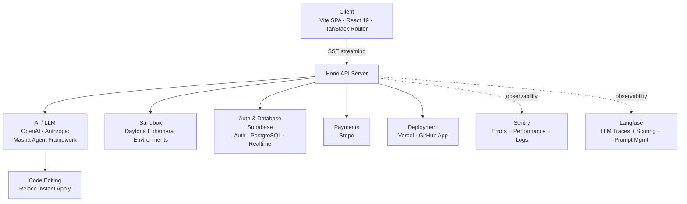

# VibeStack Platform

AI-powered app builder — users describe an app in natural language and get a full Vite + React project with live preview, deployed to production in minutes.

## Architecture



## Services

### AI / LLM

| Service | Purpose | Tier | Dashboard | Env Vars |
|---------|---------|------|-----------|----------|
| [OpenAI](https://platform.openai.com) | LLM provider (GPT-5.2 Codex) | Paid | [platform.openai.com](https://platform.openai.com) | `OPENAI_API_KEY` |
| [Anthropic](https://console.anthropic.com) | LLM provider (Claude Opus/Sonnet 4.6) | Paid | [console.anthropic.com](https://console.anthropic.com) | `ANTHROPIC_API_KEY` |
| [Mastra](https://mastra.ai) | Agent framework (orchestration, memory, tools) | OSS | — | — |
| [Relace](https://relace.ai) | Instant Apply code editing API | Paid | [relace.ai](https://relace.ai) | `RELACE_API_KEY` |

### Auth & Database

| Service | Purpose | Tier | Dashboard | Env Vars |
|---------|---------|------|-----------|----------|
| [Supabase](https://supabase.com) | Auth + PostgreSQL + Realtime subscriptions | Free tier | [supabase.com/dashboard](https://supabase.com/dashboard) | `VITE_SUPABASE_URL`, `VITE_SUPABASE_ANON_KEY`, `DATABASE_URL`, `SUPABASE_ACCESS_TOKEN`, `SUPABASE_ORG_ID` |

### Sandbox

| Service | Purpose | Tier | Dashboard | Env Vars |
|---------|---------|------|-----------|----------|
| [Daytona](https://daytona.io) | Ephemeral sandbox environments from Docker snapshots | Paid | [app.daytona.io](https://app.daytona.io) | `DAYTONA_API_KEY`, `DAYTONA_SNAPSHOT_ID` |

### Payments

| Service | Purpose | Tier | Dashboard | Env Vars |
|---------|---------|------|-----------|----------|
| [Stripe](https://stripe.com) | Checkout, subscriptions, webhooks | Free tier | [dashboard.stripe.com](https://dashboard.stripe.com) | `STRIPE_SECRET_KEY`, `VITE_STRIPE_PUBLISHABLE_KEY`, `STRIPE_WEBHOOK_SECRET` |

### Deployment

| Service | Purpose | Tier | Dashboard | Env Vars |
|---------|---------|------|-----------|----------|
| [Vercel](https://vercel.com) | Deploys generated apps | Free tier | [vercel.com/dashboard](https://vercel.com/dashboard) | `VERCEL_TOKEN`, `VERCEL_WILDCARD_PROJECT_ID` |
| [GitHub App](https://github.com/settings/apps) | Creates repos for generated apps | Free | [github.com/settings/apps](https://github.com/settings/apps) | `GITHUB_APP_ID`, `GITHUB_APP_PRIVATE_KEY`, `GITHUB_APP_INSTALLATION_ID`, `GITHUB_ORG` |

### Observability (all optional)

| Service | Purpose | Tier | Dashboard | Env Vars |
|---------|---------|------|-----------|----------|
| [Sentry](https://sentry.io) | Errors + performance + structured logs + cron monitoring (client + server + AI) | Free tier | [sentry.io](https://sentry.io) | `VITE_SENTRY_DSN`, `SENTRY_DSN` |
| [Langfuse](https://langfuse.com) | LLM observability (traces enriched with user/project/model metadata, build-success + token-efficiency scoring, prompt management with versioning) | Free tier | [cloud.langfuse.com](https://cloud.langfuse.com) | `LANGFUSE_PUBLIC_KEY`, `LANGFUSE_SECRET_KEY`, `LANGFUSE_BASEURL` |

### CI/CD & Testing

| Service | Purpose | Tier | Env Vars |
|---------|---------|------|----------|
| [GitHub Actions](https://github.com/features/actions) | CI/CD automation | Free tier | — |
| [Chromatic](https://www.chromatic.com) | Visual regression testing for Storybook | Free tier | `CHROMATIC_PROJECT_TOKEN` (GitHub secret) |

### Documentation

| Service | Purpose | Tier | Env Vars |
|---------|---------|------|----------|
| [Scalar](https://scalar.com) | API reference hosting | Free tier | — (config in `scalar.config.json`) |

### Code Quality (local only, no accounts)

| Tool | Purpose |
|------|---------|
| [OxLint](https://oxc.rs) | Linter — 670+ rules, 50-100x faster than ESLint |
| [Biome](https://biomejs.dev) | Formatter — single quotes, no semicolons, trailing commas |

## Getting Started

### Prerequisites

- [Bun](https://bun.sh) v1.3+
- [Node.js](https://nodejs.org) 22+ (required for Playwright E2E tests)
- Git

### 1. Clone and install

```bash
git clone https://github.com/your-org/vibestack-platform.git
cd vibestack-platform
bun install
```

### 2. Create service accounts

Create accounts in this order (each step may depend on the previous):

1. **Supabase** — Create a project at [supabase.com](https://supabase.com). Get the project URL, anon key, and the PostgreSQL connection string (pooler URL) from Settings → Database.
2. **OpenAI** — Get an API key from [platform.openai.com/api-keys](https://platform.openai.com/api-keys).
3. **Anthropic** — Get an API key from [console.anthropic.com](https://console.anthropic.com).
4. **Daytona** — Create an account at [daytona.io](https://daytona.io). Get your API key and create a sandbox snapshot from the `snapshot/` Dockerfile.
5. **Stripe** — Create an account at [stripe.com](https://stripe.com). Get the secret key, publishable key, and set up a webhook endpoint for `/api/stripe/webhook`.
6. **GitHub App** — Create a GitHub App at [github.com/settings/apps](https://github.com/settings/apps). Note the App ID, generate a private key, install it on your org, and note the installation ID.
7. **Vercel** — Get a token from [vercel.com/account/tokens](https://vercel.com/account/tokens). Create a wildcard project for deployments.
8. **Relace** — Get an API key from [relace.ai](https://relace.ai).
9. **Optional**: Set up [Langfuse](https://langfuse.com) and [Sentry](https://sentry.io) for observability.

### 3. Configure environment

Copy the template and fill in your values:

```bash
cp .env.local.example .env.local
```

<details>
<summary><code>.env.local</code> template</summary>

```bash
# Supabase
VITE_SUPABASE_URL=
VITE_SUPABASE_ANON_KEY=
DATABASE_URL=
SUPABASE_ACCESS_TOKEN=
SUPABASE_ORG_ID=

# AI / LLM
OPENAI_API_KEY=
ANTHROPIC_API_KEY=
RELACE_API_KEY=

# Daytona Sandbox
DAYTONA_API_KEY=
DAYTONA_SNAPSHOT_ID=

# Stripe
STRIPE_SECRET_KEY=
VITE_STRIPE_PUBLISHABLE_KEY=
STRIPE_WEBHOOK_SECRET=

# Vercel
VERCEL_TOKEN=
VERCEL_WILDCARD_PROJECT_ID=

# GitHub App
GITHUB_APP_ID=
GITHUB_APP_PRIVATE_KEY=
GITHUB_APP_INSTALLATION_ID=
GITHUB_ORG=

# Observability (optional)
VITE_SENTRY_DSN=
SENTRY_DSN=
LANGFUSE_PUBLIC_KEY=
LANGFUSE_SECRET_KEY=
LANGFUSE_BASEURL=https://cloud.langfuse.com
```

</details>

### 4. Run database migrations

```bash
bun run db:migrate
```

### 5. Start development server

```bash
bun run dev
```

### 6. Verify

Open [http://localhost:5173](http://localhost:5173), sign in with Supabase Auth, and create a project to confirm everything is working.

## Commands

| Command | Description |
|---------|-------------|
| `bun run dev` | Vite SPA + Hono API server (concurrently) |
| `bun run build` | Vite client build + typecheck |
| `bun run preview` | Vite preview of built client |
| `bun run lint` | OxLint (670+ rules) |
| `bun run lint:fix` | OxLint auto-fix |
| `bun run format` | Biome format |
| `bun run test` | Vitest unit/integration tests |
| `bun run test:e2e:mock` | Playwright E2E with mock mode |
| `bun run test:e2e:real` | Playwright E2E against real services |
| `bun run db:generate` | Drizzle Kit generate migrations |
| `bun run db:migrate` | Drizzle Kit run migrations |
| `bun run db:studio` | Drizzle Kit studio (DB browser) |
| `bun run storybook` | Storybook dev server (port 6006) |
| `bun run storybook:build` | Build static Storybook |
| `bun run chromatic` | Chromatic visual regression |

## Tech Stack

Vite 7 · React 19 · TanStack Router · Tailwind CSS v4 · shadcn/ui · Hono · Drizzle ORM · Mastra · TypeScript 5 (strict) · Supabase · Stripe · Daytona · Vercel

See [`CLAUDE.md`](./CLAUDE.md) for full architecture documentation, directory structure, and development patterns.
